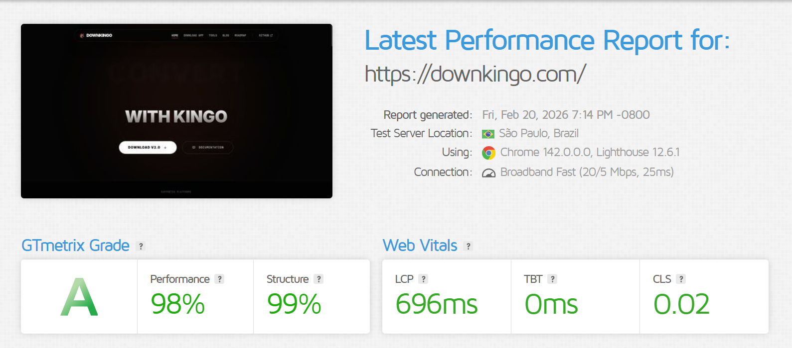
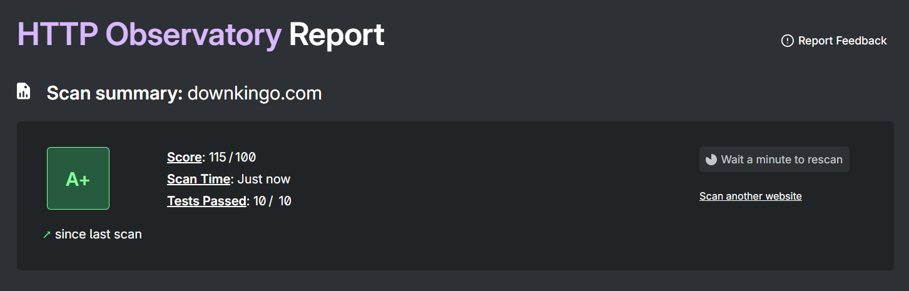

<div align="center">
  
  <h1 align="center">DownKingo — Site Oficial</h1>
  <p align="center">
    <strong>Landing page, documentação e blog do app desktop DownKingo.</strong>
  </p>
  <p align="center">
    
    
    
    
    
  </p>
</div>

---

## Sobre o Projeto

Este repositório contém o **site oficial** do [DownKingo](https://downkingo.com) — um aplicativo desktop gratuito e open source que funciona como um toolbox completo de mídia:

- Download de vídeos de **1000+ sites** (YouTube, Instagram, TikTok, Twitter, Twitch, Reddit e mais)
- Conversão de mídia em múltiplos formatos (MP4, MKV, MP3, FLAC, WAV, WebP)
- Remoção de fundo de imagens com IA (offline)
- Transcrição de áudio/vídeo para texto via Whisper (offline)
- Download de playlists completas e processamento em lote

O app desktop é construído com **Go + Wails + React 19** e usa **yt-dlp** + **FFmpeg** por baixo dos panos. Este site é a vitrine pública do projeto.

## O que o Site Inclui

| Seção | Descrição |
|---|---|
| **Landing Page** | Apresentação do app com features, terminal demo e casos de uso |
| **Download** | Página de download com detecção automática de OS (Windows/macOS/Linux) via GitHub Releases API |
| **Use Cases** | Páginas individuais para cada plataforma suportada (YouTube Downloader, Instagram Downloader, etc.) |
| **Blog** | Posts com tags, páginas de autor e suporte a conteúdo Markdown/MDX |
| **Docs** | Documentação técnica do app via Starlight (introdução, instalação, features, roadmap) |
| **i18n** | Suporte completo bilíngue EN / PT-BR com hreflang tags |

## Stack Técnica

- **Astro 5** — Static Site Generation com islands architecture
- **Starlight** — Documentação integrada ao Astro
- **Tailwind CSS 4** — Estilização utility-first
- **Bun** — Runtime e package manager
- **astro-icon** — Ícones via Iconify (Lucide + Simple Icons)
- **astro-seo** — Meta tags, Open Graph e Twitter Cards
- **Cloudflare Pages** — Deploy na edge com `_headers` para segurança (HSTS, CSP, X-Frame-Options)

## Performance

Score máximo em Core Web Vitals, acessibilidade e SEO — resultado direto do SSG do Astro com inline de CSS, compressão de assets e preload de fontes críticas.

### PageSpeed Insights


### GTmetrix


## Segurança

Headers de segurança aplicados via `_headers` e middleware seguindo recomendações OWASP: HSTS com preload, Content Security Policy restritiva, X-Frame-Options, X-Content-Type-Options e Referrer-Policy.

### Mozilla Observatory


## Setup Local

Requer [Bun](https://bun.sh) instalado.

```bash
# Instalar dependências
bun install

# Servidor de desenvolvimento
bun run dev

# Build de produção
bun run build

# Preview do build
bun run preview
```

## Estrutura do Projeto

```
src/
├── assets/          # Imagens otimizadas (avif, webp)
├── components/      # Componentes Astro reutilizáveis
├── content/         # Blog posts e docs (Markdown/MDX)
├── layouts/         # Layouts base
├── pages/
│   ├── pt/          # Páginas em Português
│   ├── blog/        # Blog (EN)
│   ├── download     # Página de download
│   └── *-downloader # Páginas de use cases por plataforma
├── styles/          # CSS global + Tailwind
public/
├── fonts/           # Fontes self-hosted (Inter, JetBrains Mono)
├── scripts/         # JS client-side (hero animation, OS detect, etc.)
└── _headers         # Headers de segurança (Cloudflare Pages)
```

## Links

- **Site:** [downkingo.com](https://downkingo.com)
- **App (GitHub):** [down-kingo/downkingo](https://github.com/down-kingo/downkingo)
- **Roadmap:** [GitHub Projects](https://github.com/orgs/down-kingo/projects/2)
